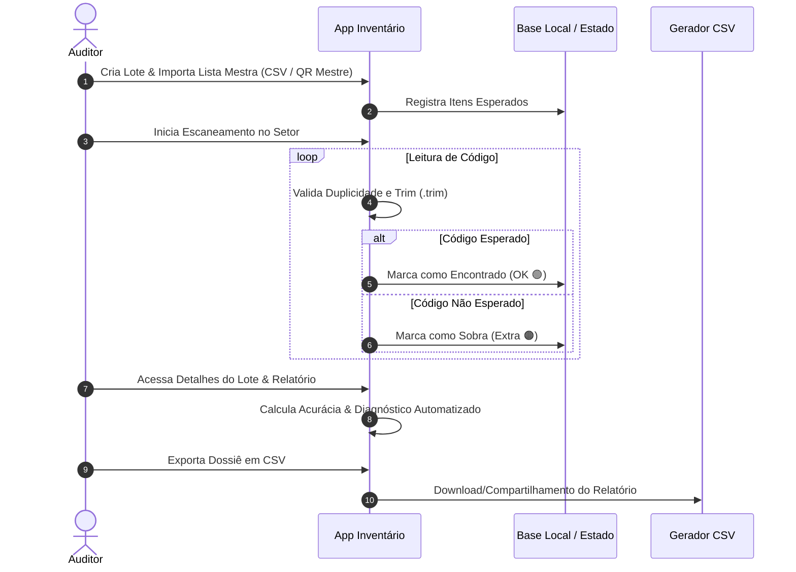

# 📦 Inventário & Auditoria Patrimonial

> **Sistema Completo de Gestão de Ativos, Leitura de Códigos (QR Code / Barcode) e Conferência Patrimonial.**

O **Inventário & Auditoria Patrimonial** é uma solução profissional para gestão de ativos e inteligência de conferência de campo. Desenvolvido com foco na produtividade de auditorias, elimina erros manuais, controla duplicidades, valida listas mestras e oferece um **Dossiê de Auditoria** com métricas em tempo real e exportação inteligente.

---

## 📱 Visualização do Aplicativo

| 📊 Dashboard & KPIs | 📷 Scanner de Alta Precisão |
| :---: | :---: |
|  |  |
| **Visão Geral, Atalhos e KPIs** | **Leitura em Tempo Real com Feedbacks** |

| 📋 Detalhes do Lote & Métricas | 📈 Relatório & Dossiê de Auditoria |
| :---: | :---: |
|  |  |
| **Barra Segmentada e Card Diagnóstico** | **Análise de Divergências e Exportação** |

---

## 📑 Índice
- [Visão Geral](#-visão-geral)
- [Screenshots & Telas](#-visualização-do-aplicativo)
- [Principais Recursos](#-principais-recursos)
- [Fluxo de Funcionamento](#-fluxo-de-funcionamento)
- [Arquitetura & Módulos](#-arquitetura--módulos)
- [Sincronização & Firebase](#-sincronização--firebase)
- [Como Executar](#-como-executar)
- [Tecnologias Utilizadas](#-tecnologias-utilizadas)
- [Licença](#-licença)

---

## ✨ Principais Recursos

### 1. 📊 Dashboard Inteligente
- **Cartões KPI Responsivos**: Total de Ativos, Lotes Pendentes e Lotes Concluídos.
- **Acesso Rápido**: Atalhos para iniciar conferências, ler códigos em sequência, importar arquivos e visualizar histórico.
- **Feed de Atividades Recentes**: Histórico atualizado de leituras e status dos lotes em andamento.

### 2. 🔍 Conferência Patrimonial (Auditoria Inteligente)
- **Importação de Lista Mestra**: Carregamento de itens esperados via **CSV** ou **QR Code Mestre** (lê uma lista inteira em uma única varredura).
- **Scanner de Alta Velocidade**: Foco automático, retículo visual e processamento sem travamentos.
- **Feedback Sensorial & Visual Instantâneo**:
  - 🟢 **Verde (OK)**: Item esperado localizado com sucesso.
  - 🔴 **Vermelho (Falta)**: Itens pendentes de leitura no setor.
  - 🟠 **Laranja (Extra)**: Item lido que não consta na lista mestra original.
- **Bloqueio de Duplicidade**: Evita a contagem repetida do mesmo código dentro do mesmo lote.

### 3. 📋 Detalhes do Lote com Métricas Visuais
- **Cabeçalho Otimizado**: Indicadores compactos de **ATIVOS**, **DATA / HORA** e botão destacado para **RELATÓRIO**.
- **Barras de Distribuição Segmentadas**:
  - 🔵 **Todos**: Total de patrimônios esperados.
  - 🟢 **OK**: Patrimônios localizados.
  - 🔴 **Falta**: Ausentes/pendentes de conciliação.
  - 🟠 **Extra (`amber-500`)**: Sobras e excedentes identificados.
- **Diagnóstico Executivo**: Card de síntese que exibe automaticamente a porcentagem de acurácia do lote e orienta os próximos passos da equipe de campo.

### 4. 📈 Relatório Executivo & Dossiê de Auditoria
- **Percentual de Acurácia**: Cálculo automatizado do nível de precisão da auditoria.
- **Filtros Interativos**: Alterne rapidamente entre a visão global, apenas itens ok, faltantes ou extras.
- **Gestão de Permissões para Exclusão**: Controle fino de remoção de leituras incorretas (Modo Bloqueado, Uma Vez ou Liberado).
- **Exportação Segmentada em CSV**: Gere relatórios específicos (ex: exportar somente a lista de itens faltantes para a equipe de busca).

---

## 🛠 Fluxo de Funcionamento



---

## 🏗 Arquitetura & Módulos

```
src/
├── components/             # Telas e Componentes da Interface
│   ├── MainScreen.tsx         # Dashboard Principal & KPIs
│   ├── VerificationScanScreen # Scanner de Câmera & Barra de Progresso
│   ├── BatchDetailsScreen     # Visão do Lote, KPIs e Barras de Métricas
│   ├── AuditResultsScreen     # Dossiê de Auditoria & Tabela de Divergências
│   ├── ImportInventoryScreen  # Central de Importação (CSV & QR Code Mestre)
│   ├── ReadSequenceScreen     # Modo Leitura Rápida em Memória
│   └── Navigation.tsx         # Barra de Navegação e Menu
├── services/               # Integração com Serviços Externos
│   ├── firebase.ts            # Sincronização em Nuvem (Firestore & Auth)
│   └── storage.ts             # Persistência Local (LocalStorage Storage Engine)
├── types.ts                   # Interfaces TypeScript e Modelos de Dados
├── main.tsx                   # Ponto de Entrada da Aplicação
└── index.css                  # Estilização Global & Variáveis de Tema (Tailwind CSS)
```

---

## 🔥 Sincronização & Firebase

O sistema opera no modelo **Offline-First**, garantindo agilidade na leitura de dados em campo sem depender de conexão contínua com a internet. Opcionalmente, permite a sincronização bidirecional em nuvem via **Google Firebase / Firestore**:

- **Backup para a Nuvem**: Envia lotes, itens esperados, histórico de scans e registros de auditoria com um clique.
- **Restauração em Nuvem**: Baixa auditorias armazenadas na nuvem para qualquer novo dispositivo.
- **Segurança de Credenciais**: As credenciais do Firebase são configuradas via **variáveis de ambiente (`.env`)**, evitando o versionamento de segredos no repositório.

---

## 🚀 Como Executar

### Pré-requisitos
- **Node.js**: v18 ou superior
- **Gerenciador de Pacotes**: `npm` ou `bun`

### Passos de Execução
1. Clone o repositório:
   ```bash
   git clone https://github.com/usuario/inventario-patrimonial.git
   cd inventario-patrimonial
   ```

2. Instale as dependências:
   ```bash
   npm install
   ```

3. (Opcional) Configure as variáveis de ambiente do Firebase:
   Crie um arquivo `.env` baseado no `.env.example`:
   ```bash
   cp .env.example .env
   ```
   E defina as credenciais do seu projeto Firebase:
   ```env
   VITE_FIREBASE_API_KEY=sua_api_key_aqui
   VITE_FIREBASE_AUTH_DOMAIN=seu_projeto.firebaseapp.com
   VITE_FIREBASE_PROJECT_ID=seu_projeto_id
   VITE_FIREBASE_STORAGE_BUCKET=seu_projeto.firebasestorage.app
   VITE_FIREBASE_MESSAGING_SENDER_ID=seu_messaging_sender_id
   VITE_FIREBASE_APP_ID=seu_app_id
   ```

4. Inicie o servidor de desenvolvimento:
   ```bash
   npm run dev
   ```

5. Acesse no seu navegador:
   `http://localhost:3000`

---

## 🧪 Tecnologias Utilizadas

- **React 18** — Componentização reativa e alta performance.
- **TypeScript** — Tipagem estática para maior segurança no código.
- **Tailwind CSS** — Estilização moderna e layout responsivo.
- **Firebase / Firestore** — Persistência e sincronização de dados em nuvem.
- **Lucide React** — Biblioteca de ícones vetoriais.
- **Motion (`motion/react`)** — Animações e transições fluídas de telas.
- **Vite** — Tooling de build ultrarrápido.

---

## 📄 Licença

Este projeto está licenciado sob a **Licença MIT** © 2026 Edinho Grubert.
